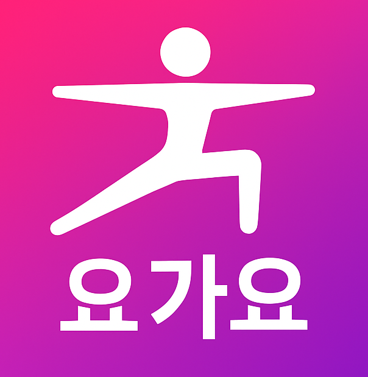
 

## 📋 목차

1. [서비스 소개](#-서비스-소개)
2. [팀원](#-팀원)
3. [주요 기능](#-주요-기능)
4. [주요 기술](#-주요-기술)
5. [산출물](#-산출물) (아키텍쳐, API 명세서, ERD)
   
    

## 🧘🏻 서비스 소개

### 🗓️ 프로젝트 기간 : 2025.02.28 ~ 2025.04.11 (7주)

</aside>

### 개요

**SSAFY 12기 2학기 특화 프로젝트**
**도메인 인공지능(영상)**

 **온디바이스AI**를 이용한 요가 교육 어플리케이션입니다.

요가요는 **온디바이스 AI** 기술을 활용하여 모바일 환경에서 요가를 학습할할 수 있는 앱입니다. 

사용자는 언제 어디서나 자신에게 맞는 요가 세션을 진행하며, 실시간 피드백을 통해 자세와 운동의 효율성을 개선할 수 있습니다. 

또한, 멀티플레이 기능을 통해 친구와 함께 요가를 즐기거나, 그룹으로 서로의 진행 상황을 공유하며 동기부여를 얻을 수 있습니다. 

 

## 🤝 팀원

<table>
  <tr>
    <td align="center" width="150px">
      <a href="" target="_blank">
        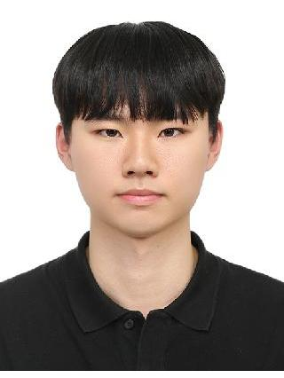
      </a>
    </td>
    <td align="center" width="150px">
      
    </td>
    <td align="center" width="150px">
      
    </td>
    <td align="center" width="150px">
      
    </td>
    <td align="center" width="150px">
      
    </td>
    <td align="center" width="150px">
      
    </td>
  </tr>
  <tr>
    <td align="center">
      <a href="" target="_blank">
        경이현 Infra/BE
      </a>
    </td>
    <td align="center">
      <a href="" target="_blank">
        김아름 Android
      </a>
    </td>
    <td align="center">
      <a href="" target="_blank">
        김웅기 AI
      </a>
    </td>
    <td align="center">
      <a href="" target="_blank">
        박성민 BE
      </a>
    </td>
    <td align="center">
      <a href="" target="_blank">
        황선혁 Android
      </a>
    </td>
    <td align="center">
      <a href="">
        황홍법 BE
      </a>
    </td>
  </tr>
</table>

## 💻 주요 기능

<strong>싱글 페이지(토글을 눌러 펼쳐주세요)</strong>

 

<table align="center" width="100%">
  <tr>
    <th align="center" width="33%">메인</th>
    <th align="center" width="33%">코스 추가하기</th>
    <th align="center" width="33%">코스 시작하기</th>
  </tr>
  <tr>
    <td align="center">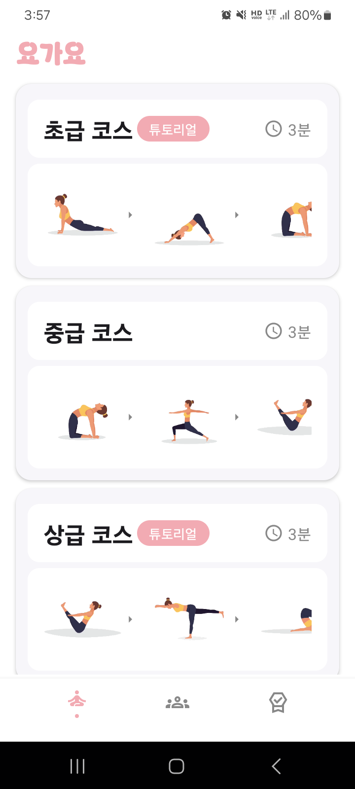</td>
    <td align="center">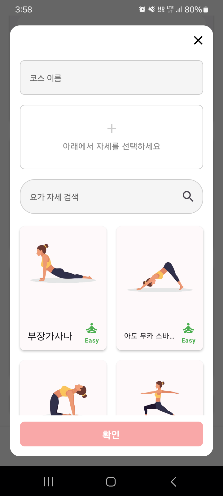</td>
    <td align="center">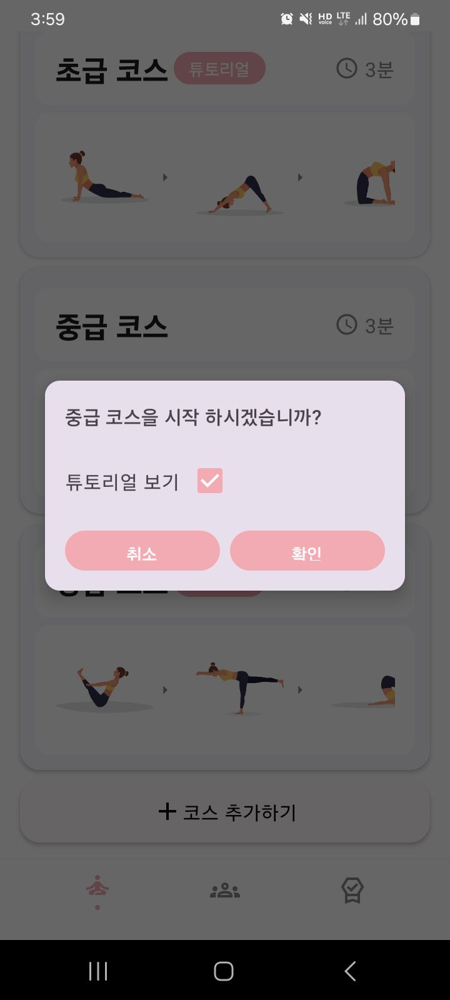</td>
  </tr>
  <tr>
    <td align="center">싱글 메인 페이지입니다. 코스를 선택할 수 있습니다.</td>
    <td align="center">코스를 추가하는 다이얼로그입니다.</td>
    <td align="center">코스시작작을 확인하는 다이얼로그입니다.</td>
  </tr>
</table>

<table align="center" width="100%">
  <tr>
    <th align="center" width="50%">요가 설명 화면</th>
    <th align="center" width="50%">플레이 화면</th>
  </tr>
   <tr>
    <td align="center">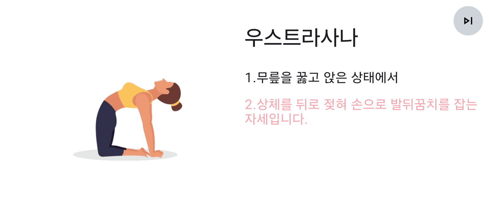</td>
    <td align="center">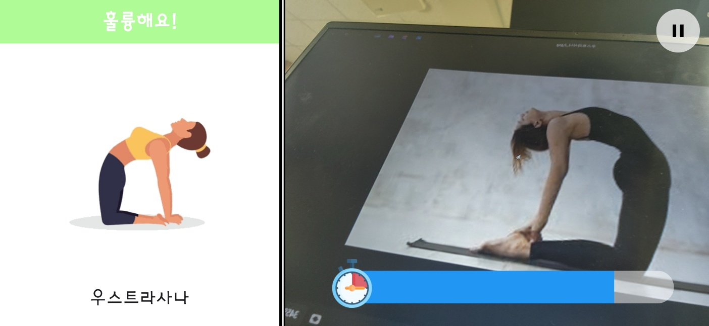</td>
  </tr>
  <tr>
    <td align="center">수행할 요가 동작을 설명하는 화면입니다.</td>
    <td align="center">요가를 하는 화면입니다. 사용자에게 실시간 피드백을 제공합니다.</td>
  </tr>
  </table>

<table align="center" width="100%">
   <tr>
    <th align="center" width="50%">결과 화면</th>
    <th align="center" width="50%">결과 상세 화면</th>
  </tr>
  <tr>
    <td align="center">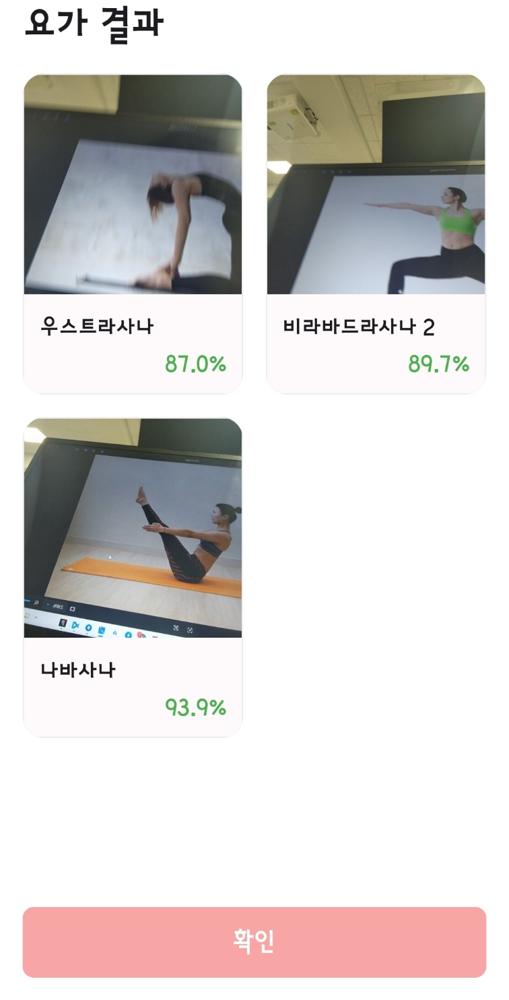</td>
    <td align="center">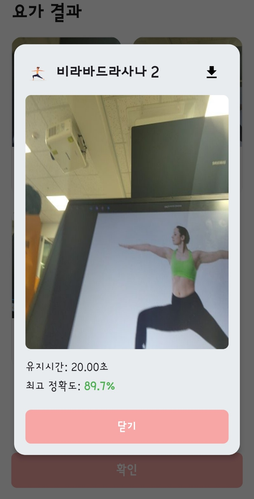</td>
  </tr>
    <td align="center">코스 결과 화면입니다. 사용자의 요가 사진을 보여줍니다.</td>
    <td align="center">동작 상세 화면입니다. 요가 사진을 다운로드 받을 수 있습니다.</td>
  </tr>
</table>

<strong>멀티 페이지(토글을 눌러 펼쳐주세요)</strong>

 

<table align="center" width="100%">
  <tr>
    <th align="center" width="25%">멀티 로비 화면</th>
    <th align="center" width="25%">방 생성 다이얼로그</th>
    <th align="center" width="25%">코스 생성 다이얼로그</th>
    <th align="center" width="25%">방 입장 다이얼로그</th>
  </tr>
  <tr>
    <td align="center">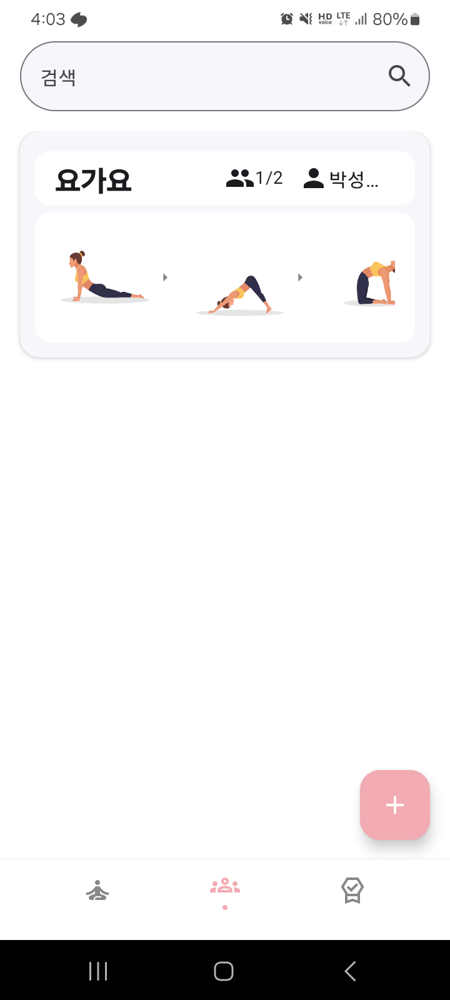</td>
    <td align="center">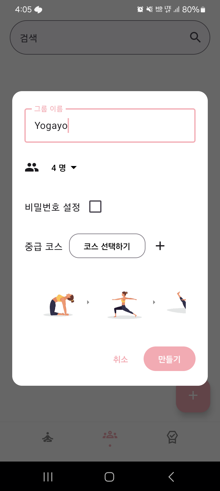</td>
    <td align="center">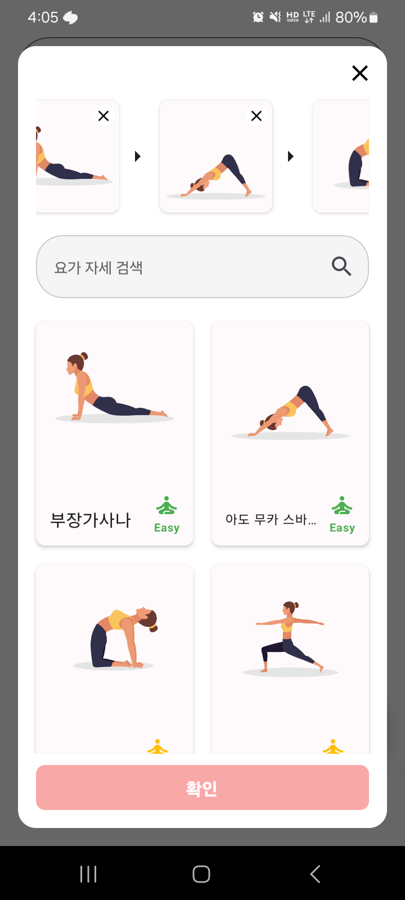</td>
    <td align="center">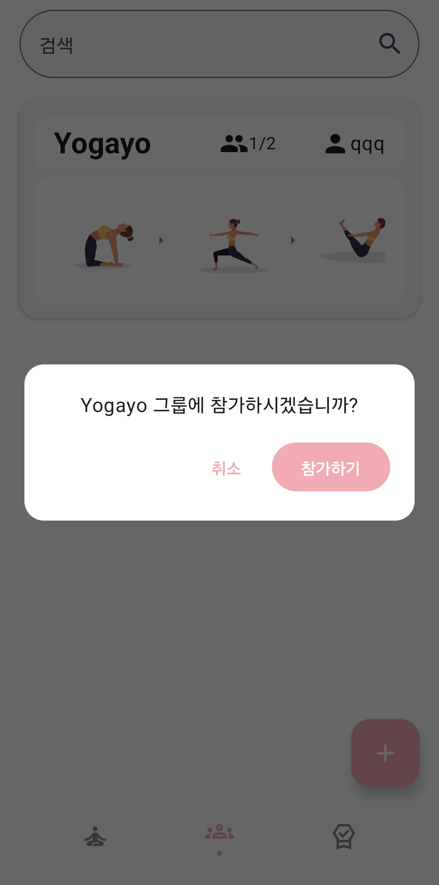</td>
  </tr>
  <tr>
    <td align="center">멀티 로비화면입니다. 방 목록을 확인할 수 있습니다.</td>
    <td align="center">방 생성 다이얼로그입니다. 코스를 선택할 수 있습니다</td>
    <td align="center">임시 코스 생성 다이얼로그 입니다.</td>
    <td align="center">방 입장 다이얼로그입니다.</td>
  </tr>
</table>

<table align="center" width="100%">
  <tr>
    <th align="center" width="33%">대기 화면</th>
    <th align="center" width="33%">플레이 화면</th>
    <th align="center" width="33%">요가 결과 화면</th>
  </tr>
  <tr>
    <td align="center">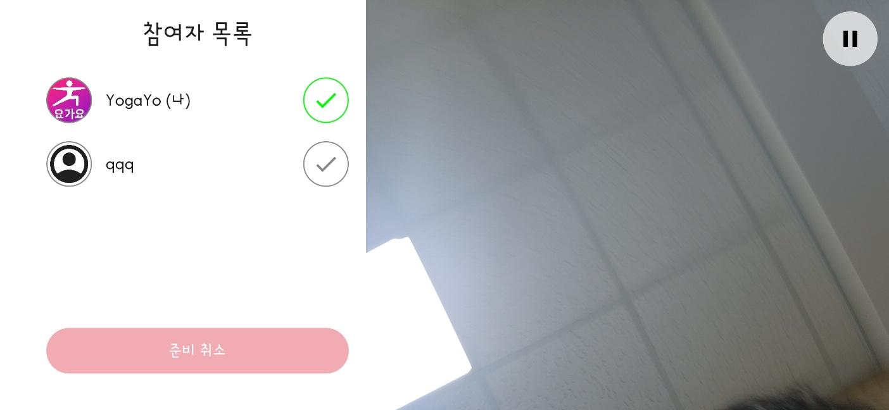</td>
    <td align="center"></td>
    <td align="center">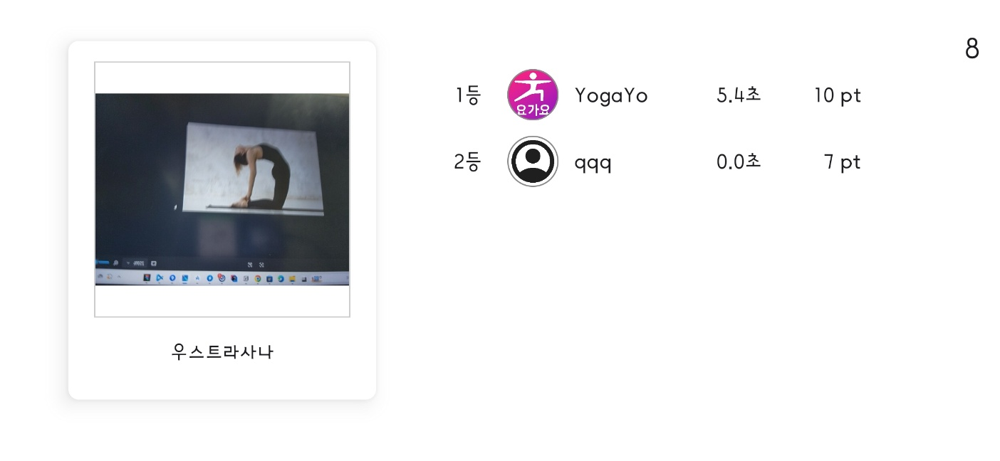</td>
  </tr>
  <tr>
    <td align="center">시작 전 대기하는 화면입니다. 모든 유저들이 준비되면 시작됩니다.</td>
    <td align="center">플레이 화면입니다. 실시간 피드백을 받을 수 있습니다</td>
    <td align="center">이번 동작에 대한 다른 유저들의 점수와 최고 점수 유저의 사진을 볼 수 있습니다.</td>
  </tr>
</table>

<table align="center" width="100%">
  <tr>
    <th align="center" width="33%">최종 결과 화면</th>
    <th align="center" width="33%">종합 갤러리 화면</th>
    <th align="center" width="33%">상세 갤러리 화면</th>
  </tr>
  <tr>
    <td align="center">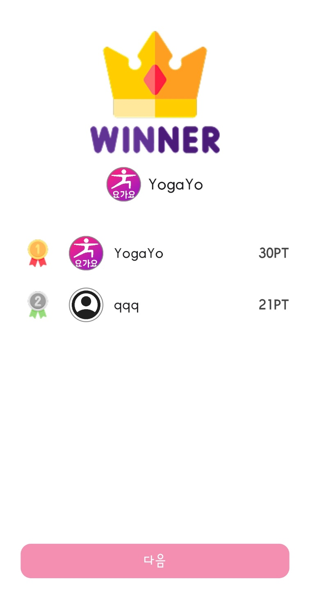</td>
    <td align="center">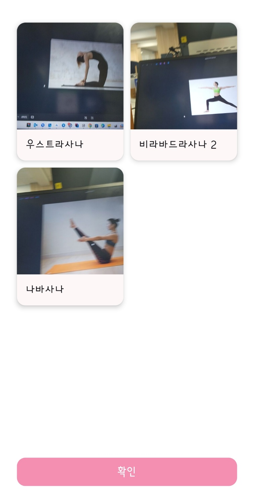</td>
    <td align="center">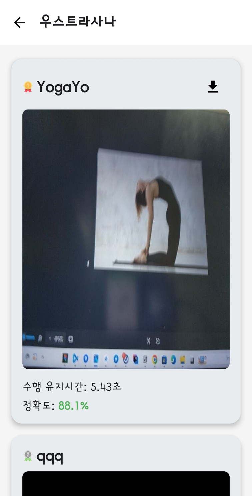</td>
  </tr>
  <tr>
    <td align="center">최종 순위를 표시하는 화면입니다.</td>
    <td align="center">요가 별 최고 점수 유저의 사진을 보여주는 화면입니다.</td>
    <td align="center">특정 동작의 모든 유저의 사진을 보여주는 화면입니다다.</td>
  </tr>
</table>

<strong>프로필 페이지(토글을 눌러 펼쳐주세요)</strong>

 

<table align="center" width="100%">
  <tr>
    <th align="center" width="25%">프로필 메인 화면</th>
    <th align="center" width="25%">기록 상세 보기 화면</th>
    <th align="center" width="25%">요가 동작 별 상세 정보 화면</th>
    <th align="center" width="25%">뱃지 상세 화면</th>
  </tr>
  <tr>
    <td align="center">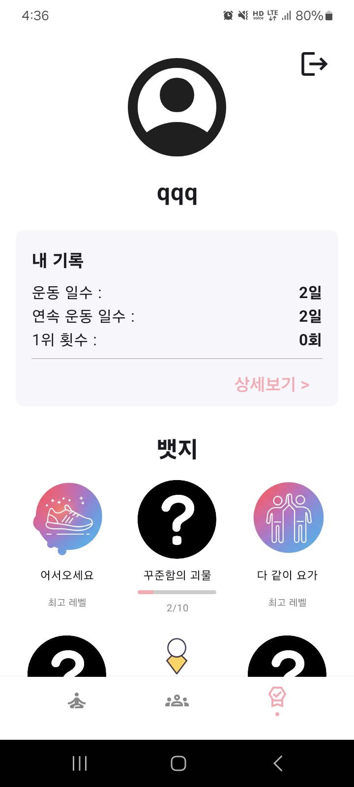</td>
    <td align="center">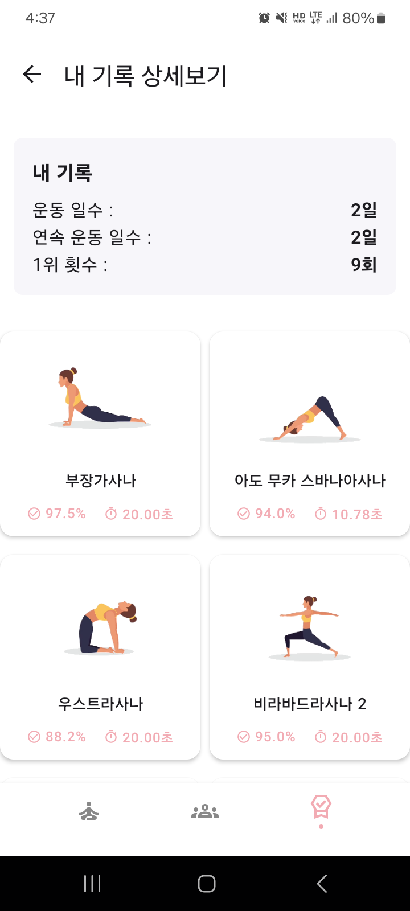</td>
    <td align="center">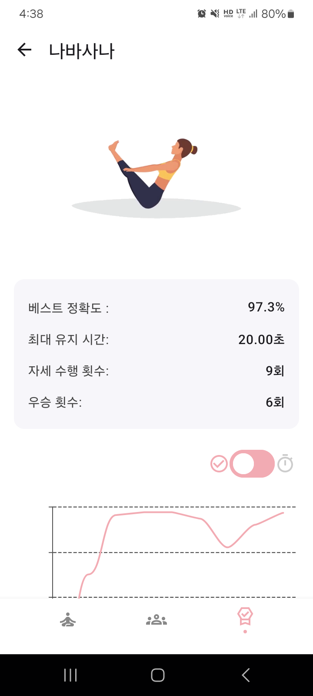</td>
    <td align="center">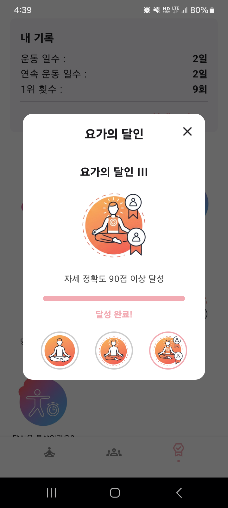</td>
  </tr>
  <tr>
    <td align="center">프로필 메인 화면입니다. 기록과 획득 뱃지를 볼 수 있습니다.</td>
    <td align="center">기록 상세 보기 화면입니다. 동작별 간략한 기록을 볼 수 있습니다.</td>
    <td align="center">요가 동작 별 상세화면입니다. 과거 기록들과 그래프화된 기록을 볼 수 있습니다.</td>
    <td align="center">뱃지 상세 화면입니다. 달성 조건들을 확인 할 수 있습니다.</td>
  </tr>
</table>

## 🧑‍💻 주요 기술

### [ 요가요 ]

- **온디바이스 AI**

### [ FRONT ]

- **Android**

- **Jetpack Compose**

- **Hilt**

- **Coil**

- **Retrofit**

- **OkHttp**

- **WebSocket**

- **WebRTC**

- **MVI 패턴**

- **클린 아키텍처**

### [ BACK ]

- **시그널링 서버**

 

## 산출물
 
#### 아키텍쳐
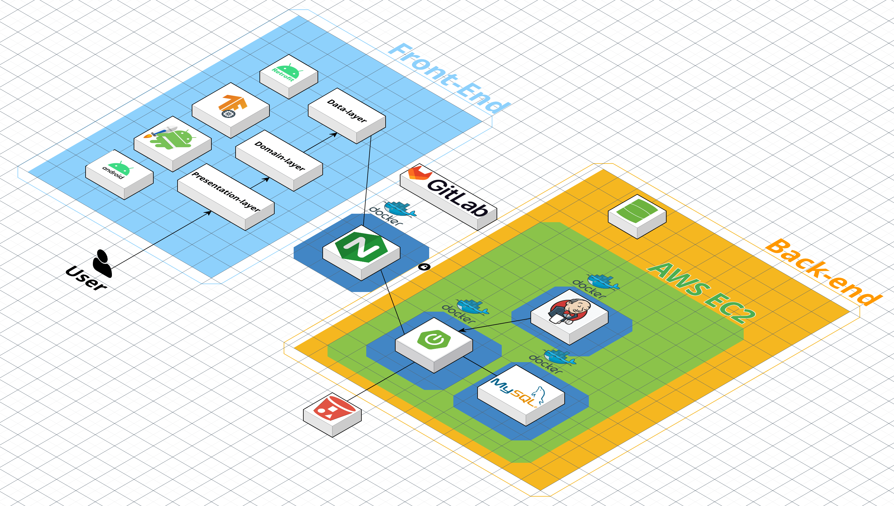

#### API 명세서

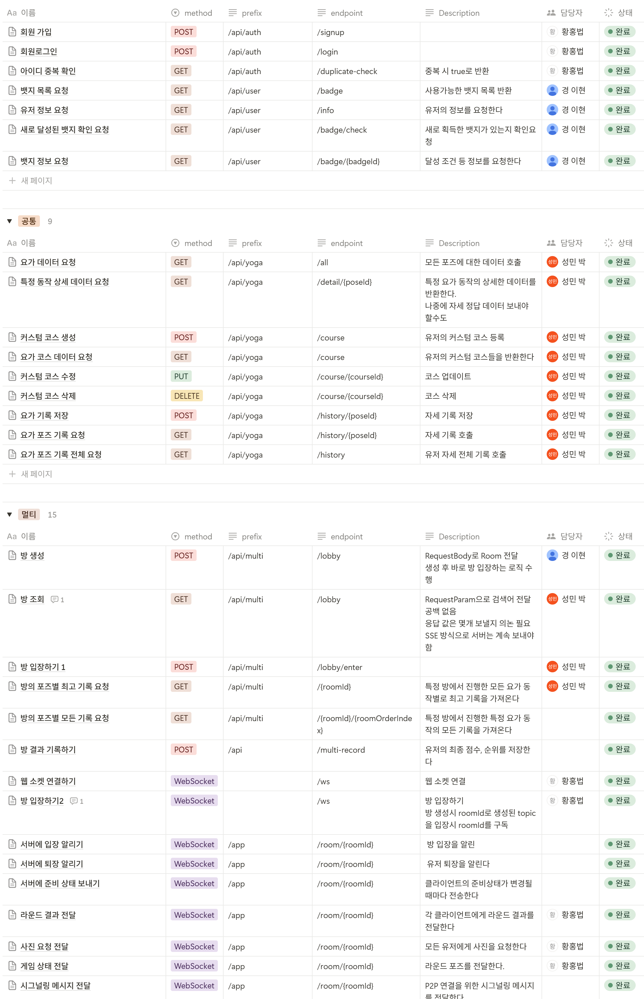

#### ERD

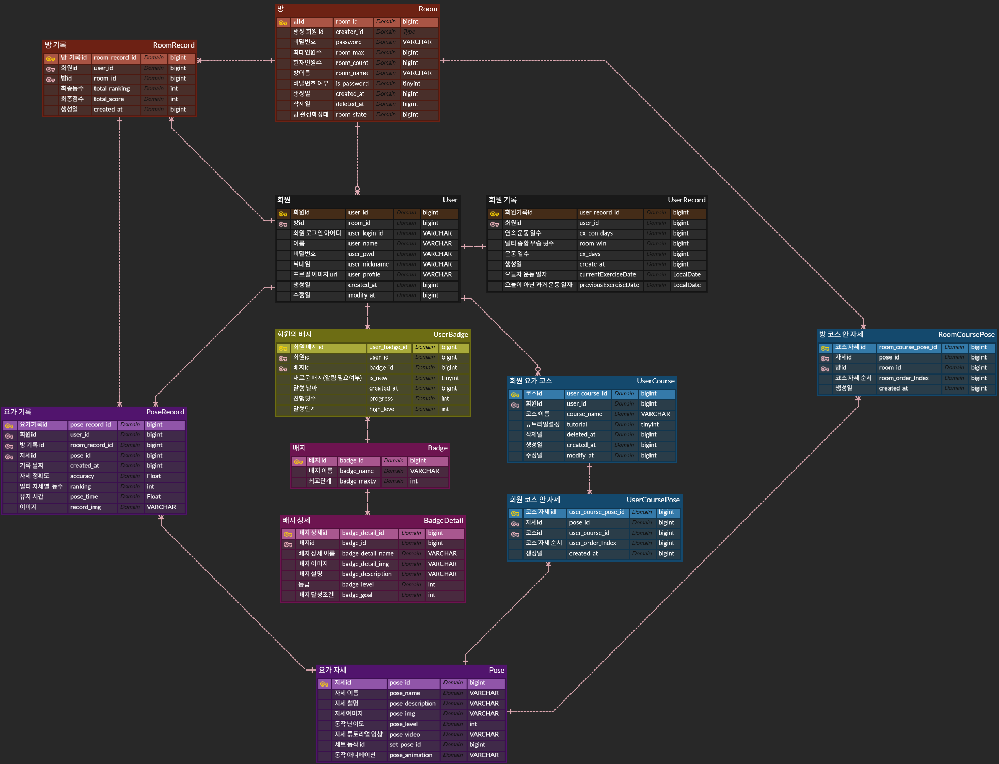

 
